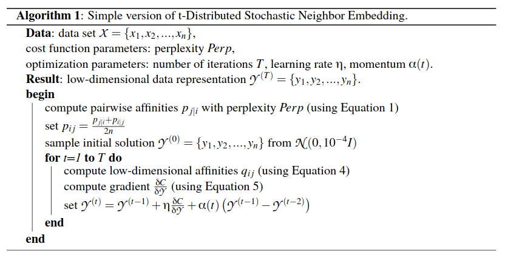

# Introduction 
# PCA
- PCA is a statistical approach to reducing data set 
- In a sense, it takes the covariance matrix of each feature and diagonalizes the matrix with each eigenvector normalized to form an orthonormal basis 
- We often that find the largest eigenvalue often correspond to the variance of our dataset
- Moreover, we find that we can define cumulative explained variance of a certain component can be found by dividing the eigenvalue corresponding to the eigenvector to the sum of all eigenvalues
## t-SNE:
### Primer:
- Assume we have n-observations then we can define a t-distribution with $f = n -1$ degrees of freedoms  
- We the can define a distribution where the distribution is defined as locstion of the sample mean relative to the true mean divided by the standard deviuation after multiplying by standarized term $\sqrt{n}$ 
## An Overview of t-SNE
- Technique to visualize data of higher dimension by mapping each data point to usually a two dimensional or three dimensional space
- Based on a t-distribution
  - $R^{n} \rightarrow R^{2}$ or $R^n \rightarrow R^{3}$
  - Constructs a gaussian distribution amongst high-dimensional objects such that similar point opairs are assigned a higher probability
  - Then this probability distribution is mapped on to lower dimension space following a t-distribution and to minimize KL divergence 
    - KL divergence can be viewed as the difference between the absolute value of entropy of some distribution P(x) plus some entropy of distribution $Q(x)$
    - Below here is a simple iterative algorithm to summarize the nature of t-SNE
    - 
## Shared Nearest Neighbor
- Traditional clusterring algorithms such as K-means provide a polynomial runtime algorithm to order a set of unlabelled data and find structural similarity (2)
- With higher dimension, the flaws of these traditional algorithms are clear due to the high dimensionality data it may be harder to capture similarities within data in a meaningful manner (2)
  -  The $L_2$ norm is not a good metric to measure similarity of data for high dimensional data
- SNN aims to alleviate this issue:
  - Combines Jarvis-Patrick with DB-scan 
  - Before we delve into the details of SNN, let's first explore the nature of Jarvis-Patrick:
    - Represent the dataset as weighted complete graph $G = (V(G),E(G))$ where edge weight denotes Euclidean distance 
    - Find k-nearest neighbors of all points, and define a function $f(x): V(G) \rightarrow V(G)$ that provides a mapping of some vertex $u$ to $v$ where v denotes the k-nearest neighbor of u 
    - Let's define the setting of mappings as set of tuples $N$
    - We then build our similarity table $S$ based on $N$, let $s_{v,u} \in \R, u\in V(G)$ denote the similarity score of each vertex pair where similarity score is the number of shared neighbors and 0 if k-nearest neighbor isn't shared
    - Once our table S is constructed we can cluster based on the number of shared neighbors and the k parameter
- SNN is a variation of this algorithm that also utilizes DB-scan
- In essence, we precompute the similarity matrix, then we reduce the size of similarity matrix by removing every instance of matrix where similarity is 0
- We then build a graph of the remaining similarity table and select core points to form our neighborhood based on the constraint such that for the KNN list that $sim(u,v) \geq \epsilon $
- We then assign points based on if density is greater than the minimum points and form clusters based on $\epsilon$
- We then align points to cluster
- The overall time complexity of this approach is $O(n^2)$
## Dimensionality Reduction 
### Feature Selection for Individual Datasets: VST
- The following algorithm aims to find differences between features by aiming to find highly variable features
- Simply choosing genes based on the variances between the cells fails to account for the mean variance relationship that is inherent to single-cell RNA-seq (1)
- To compute the mean variance relationship of the data, we can compute the mean and variance of each gene utilizing unnormalized data and applie a $log_{10}$ transformations to both (1)
- Then utilzing regression, we fit a polynomial to predict the variance of each gene or feature as a function of it's mean let's denote this as $f(x): \R \rightarrow \R$ (1)
- Once our regressor is made, we perform normalization based on the data 
- Given a count matrix, let's define $X$ as the row vector of features and $X_{\mu}$ denote the vector corresponding to each mean of the feature
- Let $Z$ define the normalized vector of $X$, moreover let's define a function: $g(X): \R^{|X|} \rightarrow \R^{|X|}, x \in \R^{|X|}$  where our function $g(X)$ performs $f(x)$ on each entry of X. (1)
- We then calculate the standarized variance defined as $\frac{X - X_{\mu}}{g(X)}$ and select features based on this variance (1)
Relevant Sources:
1. https://www.sciencedirect.com/science/article/pii/S0092867419305598?via%3Dihub
2. https://ieeexplore.ieee.org/document/7839671
3.  https://tivadardanka.com/blog/how-tsne-works
4.  
